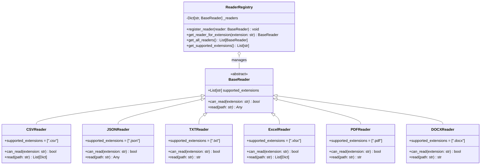

# Component Diagram

The following diagram illustrates the relationship between components in the `unified_file_reader` package:

```mermaid
classDiagram
    class BaseReader {
        <<abstract>>
        +List[str] supported_extensions
        +can_read(extension: str) bool*
        +read(path: str) Any*
    }

    class ReaderRegistry {
        -Dict[str, BaseReader] _readers
        +register_reader(reader: BaseReader) void
        +get_reader_for_extension(extension: str) BaseReader
        +get_all_readers() List[BaseReader]
        +get_supported_extensions() List[str]
    }

    class CSVReader {
        +supported_extensions = [".csv"]
        +can_read(extension: str) bool
        +read(path: str) List[Dict]
    }

    class JSONReader {
        +supported_extensions = [".json"]
        +can_read(extension: str) bool
        +read(path: str) Any
    }

    class TXTReader {
        +supported_extensions = [".txt"]
        +can_read(extension: str) bool
        +read(path: str) str
    }

    class ExcelReader {
        +supported_extensions = [".xlsx"]
        +can_read(extension: str) bool
        +read(path: str) List[Dict]
    }

    class PDFReader {
        +supported_extensions = [".pdf"]
        +can_read(extension: str) bool
        +read(path: str) str
    }

    class DOCXReader {
        +supported_extensions = [".docx"]
        +can_read(extension: str) bool
        +read(path: str) str
    }

    BaseReader <|-- CSVReader
    BaseReader <|-- JSONReader
    BaseReader <|-- TXTReader
    BaseReader <|-- ExcelReader
    BaseReader <|-- PDFReader
    BaseReader <|-- DOCXReader

    ReaderRegistry o-- BaseReader : manages
```
