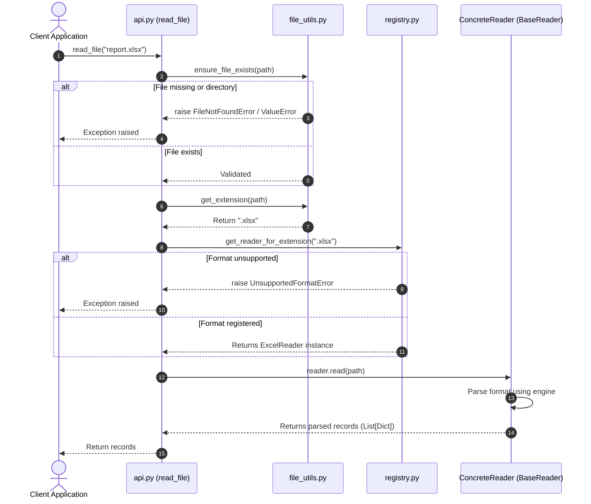

# Data Flow

The sequence below describes the flow of control and data when invoking `read_file(path)`:

```mermaid
sequenceDiagram
    autonumber
    actor Client as Client Application
    participant API as api.py (read_file)
    participant Utils as file_utils.py
    participant Reg as registry.py
    participant Reader as ConcreteReader (BaseReader)

    Client->>API: read_file("report.xlsx")
    API->>Utils: ensure_file_exists(path)
    alt File missing or directory
        Utils-->>API: raise FileNotFoundError / ValueError
        API-->>Client: Exception raised
    else File exists
        Utils-->>API: Validated
    end

    API->>Utils: get_extension(path)
    Utils-->>API: Return ".xlsx"

    API->>Reg: get_reader_for_extension(".xlsx")
    alt Format unsupported
        Reg-->>API: raise UnsupportedFormatError
        API-->>Client: Exception raised
    else Format registered
        Reg-->>API: Returns ExcelReader instance
    end

    API->>Reader: reader.read(path)
    Reader->>Reader: Parse format using engine
    Reader-->>API: Returns parsed records (List[Dict])
    API-->>Client: Return records
```
